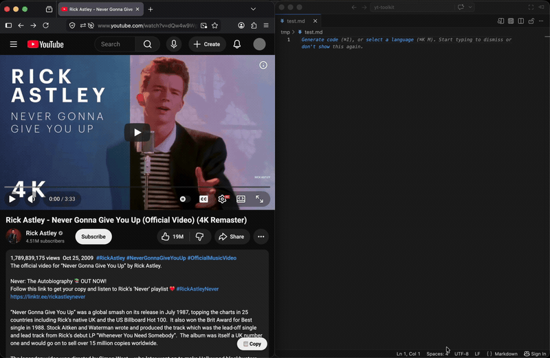

# YT Toolkit

A userscript that adds small tools to YouTube watch pages. No build step, no
npm, no dependencies — it's a single standalone `.user.js` file.

  

## Tools

A floating **📋 Copy** button on watch pages (and Shorts) opens a small **source
picker** — check what you want, hit **Copy**, and it lands on your clipboard as
one Markdown document (shared frontmatter + a section per source):

- **Transcript** — auto-opens the transcript panel and copies chapter-grouped
  prose with clickable timestamp links.
- **✦ Ask** — copies YouTube's own ✦ Ask (Gemini) answers as `**Q:**`/`**A:**`
  pairs, keeping the AI's cited timestamps as links. Opportunistic: if you
  haven't asked anything, it's skipped rather than blocking the transcript.

On **Shorts** (which have no transcript panel) the button hops to the same
video's watch page and copies from there.

### Planned

- **Description → Markdown** — another checkbox in the composer.
- **Ask AI (external)** — send the transcript to an LLM *we* call and ask about
  the video.

## Install

You need a userscript manager — **[Violentmonkey]** or **[Tampermonkey]** (both
work on Chrome and Firefox). Then:

- **GreasyFork (recommended):** install from the
  [GreasyFork page](https://greasyfork.org/en/scripts/584307-yt-toolkit) — one
  click, with **auto-update**.
- **One-click from source:** open the raw
  [`yt-toolkit.user.js`](https://raw.githubusercontent.com/kalmigs/yt-toolkit/main/yt-toolkit.user.js)
  — the manager intercepts it and offers to install, also with **auto-update on
  every push**.
- **Manual:** copy the contents of `yt-toolkit.user.js` and create a new script
  in the manager (no auto-update this way).

[Violentmonkey]: https://violentmonkey.github.io/
[Tampermonkey]: https://www.tampermonkey.net/

> The manager keeps its **own copy** of the script. With one-click install it
> auto-updates; with a manual paste, re-import after editing the file.

## How it works

Browsers can't write local files, so each tool **copies to the clipboard**
rather than saving. The transcript reader walks YouTube's live DOM (handling
both the "classic" and "viewmodel" transcript layouts) and groups segments into
paragraphs — it doesn't scrape a saved HTML dump. The ✦ Ask reader converts the
answer HTML already rendered in YouTube's Ask panel back into Markdown.

Clipboard write prefers `navigator.clipboard.writeText` (verifiable) and falls
back to `GM_setClipboard`.

## Privacy

No network calls, no tracking, no external services. The script only reads the
page you're already on and writes the result to **your clipboard** — nothing
leaves your browser. `@grant` is limited to `GM_setClipboard` (a clipboard
fallback); there are no remote requests.

## Notes

YouTube is a single-page app, so the button re-mounts on in-app navigation
(`yt-navigate-finish`), not just on hard page loads.

## License

[MIT](LICENSE) © kalmigs
